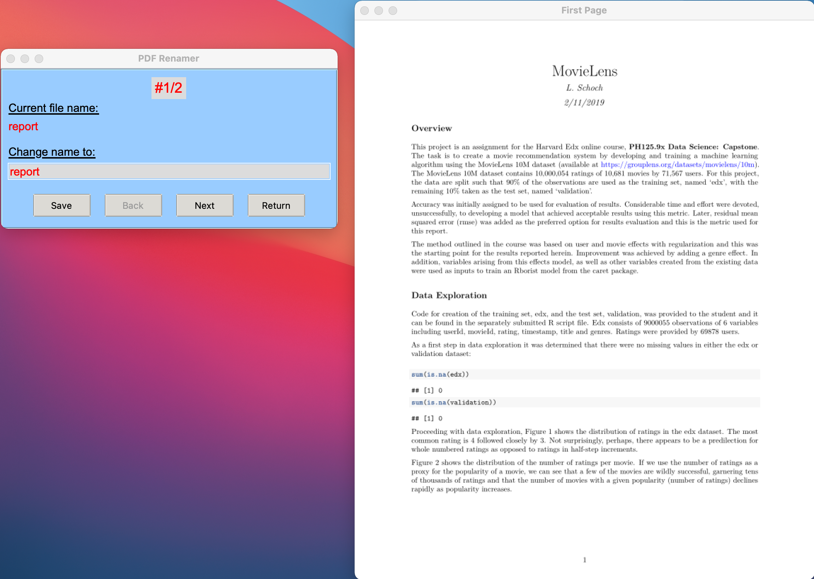

# 📂      *PDF renamer*&copy;      ⏱️
### A desktop application to quickly view and rename the pdf files in a user-selected directory.
#### Video Demo:
#### GitHub: https://github.com/lschoch/PDF_renamer.git
#### Description:

*PDF renamer*&copy; is a Python script that allows users to iterate through each pdf file in a directory of their choosing. The first page of the file is displayed and this image can be used in deciding whether to rename the file, and what the new name will be, based on the file contents. The GUI is implemented with the *Tkinter* library and rendering of the pdf images uses the *PyMuPDF* and *Pillow* libraries. 

This project consists of three files: the program file is named *PDF renamer.py*. Dependencies are listed in *requirements.txt* and finally there is the *README.md* file which is this document. There is also a folder which contains the images for *README.md*.

\
When the program is started, an introductory screen is displayed:

\
Clicking `start` takes the user to a file dialog where he or she can select the directory that contains the pdf file(s) of interest. After the directory is selected, the following screen is displayed which allows the user to iterate through each file with the option to rename:

\
Developing *PDF renamer*&copy; necessitated learning to use three Python libraries previously unknown to me: *Tkinter*, *Pillow* and *PyMuPDF*. This alone required a considerable investment of time and countless Google searches along the way, a process all too familiar to this novice software developer.

Why a utility for renaming pdf files? I scan numerous documents to maintain a paperless home office. This results in a long queue of pdf files that basically have just a time stamp for a name. Finding, sorting and filing these documents is cumbersome at best without a descriptive file name. Of course, I could go back and rename each file using the functionality provided by the operating system but that would involve the time-consuming process of opening the file to see what it contains before deciding on a name reflective of its contents. With *PDF renamer*&copy; I can rapidly scroll through each file, view the first page and rename it, all in a single step. The image of the first page appears instantaneously along with the entry box for entering the new name. Granted, this is a very narrowly focused task but *PDF renamer*&copy; is already saving me considerable time and effort, plus I had the experience of creating a GUI, something that has intrigued me for years. It is my hope that others will find *PDF renamer*&copy; to be as useful as I have.  
